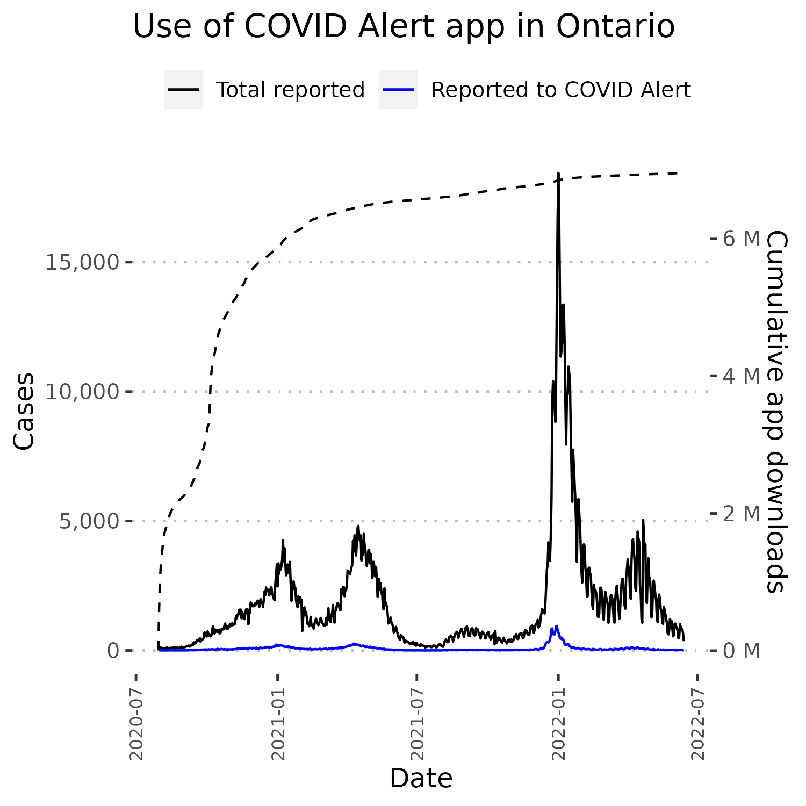

# Random Charts From the COVID-19 Pandemic

## Table of Contents

* [Ontario – Weekly % Positivity (Non-LTC) by PHU and Age Group](#ontario--weekly--positivity-non-ltc-by-phu-and-age-group)
* [COVID-19 Cases and Deaths - Ontario Versus Florida](#covid-19-cases-and-deaths---ontario-versus-florida)
* [Northwest Territories - Sub-HR Data](#northwest-territories---sub-hr-data)
* [Use of COVID Alert app in Ontario](#use-of-covid-alert-app-in-ontario)

## Ontario – Weekly % Positivity (Non-LTC) by PHU and Age Group

## COVID-19 Cases and Deaths - Ontario Versus Florida

## Northwest Territories - Sub-HR Data

## Use of COVID Alert app in Ontario

